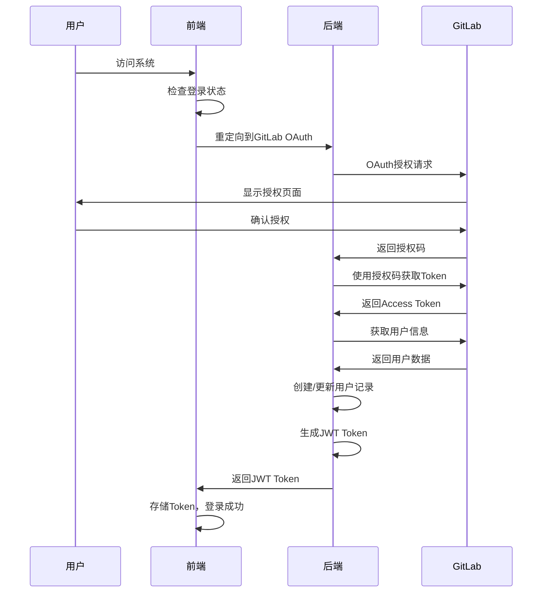
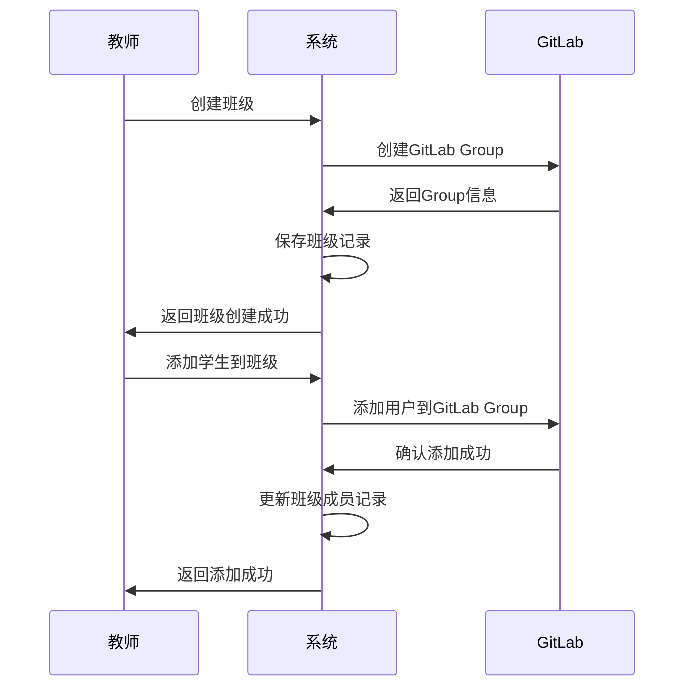
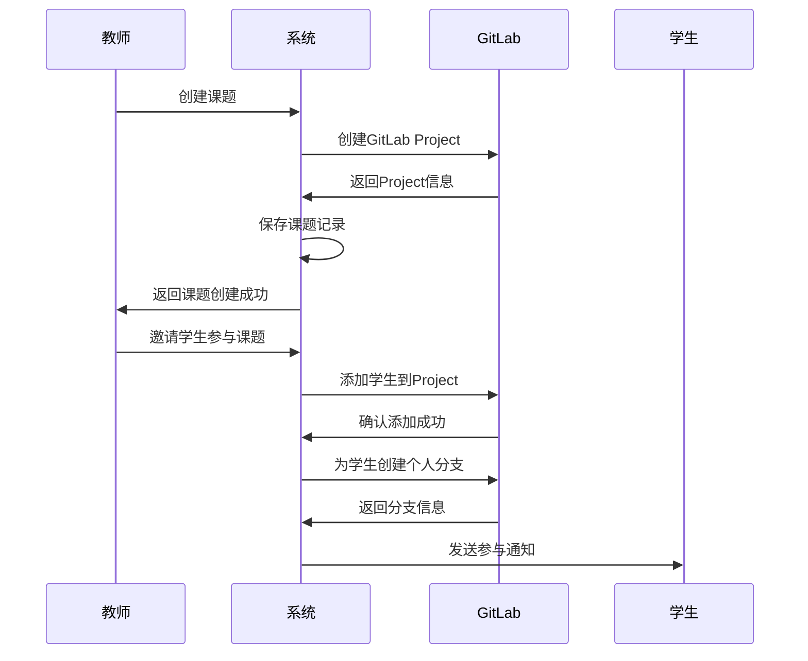
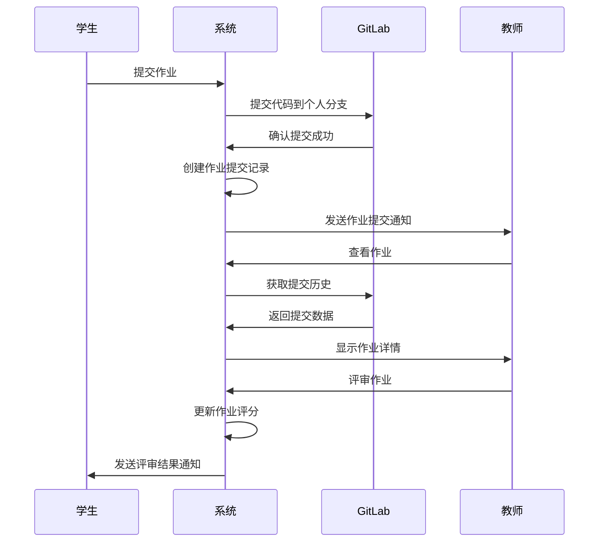

# GitLabEx 教育协作平台 - 解决方案设计

## 概述

GitLabEx 是一个基于 GitLab 的教育协作平台，专为教学场景设计的现代化教育管理系统。通过深度集成 GitLab 生态系统，提供完整的教育场景解决方案。

### 核心理念

- 🔗 **最大化复用GitLab能力** - 用户管理、团队协作、权限控制、项目管理完全依赖GitLab
- 📚 **教育场景优化** - 针对教学流程的专业功能设计
- 🎯 **简化操作流程** - 为教师和学生提供直观易用的界面
- 🚀 **企业级安全** - 完整的OAuth认证和API安全机制
- 🌐 **第三方集成** - 完善的第三方系统集成能力

### 技术架构概览

```
┌─────────────────┐    ┌─────────────────┐    ┌─────────────────┐
│   前端应用       │    │   后端服务       │    │   GitLab集成    │
│                 │    │                 │    │                 │
│ - Vue 3.4+      │    │ - Go 1.21+      │    │ - OAuth 2.0     │
│ - Element Plus  │    │ - Gin Framework │    │ - API集成       │
│ - 简化界面       │    │ - 轻量业务逻辑    │    │ - 权限控制       │
│ - 响应式设计     │    │ - PostgreSQL    │    │ - 数据同步       │
└─────────────────┘    └─────────────────┘    └─────────────────┘
```

## 架构设计

### 系统架构

```
┌─────────────────────────────────────────────────────────────────┐
│                        GitLabEx 教育协作平台                      │
├─────────────────────────────────────────────────────────────────┤
│                          前端层 (Vue 3)                          │
│  ┌─────────────┐ ┌─────────────┐ ┌─────────────┐ ┌─────────────┐ │
│  │   仪表板     │ │   班级管理   │ │   课题管理   │ │   作业管理   │ │
│  └─────────────┘ └─────────────┘ └─────────────┘ └─────────────┘ │
│  ┌─────────────┐ ┌─────────────┐ ┌─────────────┐ ┌─────────────┐ │
│  │   文档管理   │ │   话题讨论   │ │   统计分析   │ │   通知管理   │ │
│  └─────────────┘ └─────────────┘ └─────────────┘ └─────────────┘ │
├─────────────────────────────────────────────────────────────────┤
│                        后端服务层 (Go)                           │
│  ┌─────────────┐ ┌─────────────┐ ┌─────────────┐ ┌─────────────┐ │
│  │  认证服务    │ │  用户服务    │ │  班级服务    │ │  课题服务    │ │
│  └─────────────┘ └─────────────┘ └─────────────┘ └─────────────┘ │
│  ┌─────────────┐ ┌─────────────┐ ┌─────────────┐ ┌─────────────┐ │
│  │  作业服务    │ │  讨论服务    │ │  文档服务    │ │  通知服务    │ │
│  └─────────────┘ └─────────────┘ └─────────────┘ └─────────────┘ │
│  ┌─────────────┐ ┌─────────────┐ ┌─────────────┐ ┌─────────────┐ │
│  │  权限服务    │ │  分析服务    │ │ 第三方API   │ │  GitLab服务 │ │
│  └─────────────┘ └─────────────┘ └─────────────┘ └─────────────┘ │
├─────────────────────────────────────────────────────────────────┤
│                        数据存储层                                │
│  ┌─────────────┐ ┌─────────────┐ ┌─────────────┐ ┌─────────────┐ │
│  │ PostgreSQL  │ │   Redis     │ │   GitLab    │ │ OnlyOffice  │ │
│  │   数据库     │ │   缓存      │ │   代码仓库   │ │   文档服务   │ │
│  └─────────────┘ └─────────────┘ └─────────────┘ └─────────────┘ │
└─────────────────────────────────────────────────────────────────┘
```

### 技术栈选择

#### 前端技术栈
- **Vue 3.4+** - 现代化前端框架
- **TypeScript** - 类型安全的JavaScript
- **Element Plus** - 企业级UI组件库
- **Vite** - 快速的构建工具
- **Pinia** - 状态管理
- **Vue Router** - 路由管理

#### 后端技术栈
- **Go 1.21+** - 高性能后端语言
- **Gin** - 轻量级Web框架
- **GORM** - ORM数据库操作
- **PostgreSQL 15+** - 关系型数据库
- **Redis 7+** - 内存数据库
- **JWT** - 身份认证

#### 集成服务
- **GitLab CE** - 版本控制和协作
- **OnlyOffice** - 在线文档编辑
- **Docker** - 容器化部署

## 流程设计

### 用户认证流程



### 班级管理流程



### 课题管理流程



### 作业提交流程



## 权限系统设计

### 角色定义

```go
// 教育角色枚举 - 基于GitLab权限映射
type EducationRole int

const (
    EduRoleGuest     EducationRole = 10 // GitLab Guest -> 访客
    EduRoleStudent   EducationRole = 20 // GitLab Reporter -> 学生
    EduRoleAssistant EducationRole = 30 // GitLab Developer -> 助教
    EduRoleTeacher   EducationRole = 40 // GitLab Maintainer -> 教师
    EduRoleAdmin     EducationRole = 50 // GitLab Owner -> 管理员
)
```

### 权限控制规则

#### 1. 系统级权限
- **管理员（Admin）**: 系统管理员，拥有所有权限
- **教师（Teacher）**: 可以创建和管理班级、课题、作业
- **学生（Student）**: 可以参与班级和课题，提交作业
- **访客（Guest）**: 只读权限，无法进入系统

#### 2. 班级级权限
- **班级创建者**: 完全管理权限
- **班级教师**: 管理班级成员和课题
- **班级学生**: 参与班级活动和课题

#### 3. 课题级权限
- **课题创建者**: 完全管理权限
- **课题教师**: 管理课题进度和作业
- **课题学生**: 参与课题开发和作业提交

#### 4. 资源级权限
- **文档权限**: 基于GitLab Wiki权限
- **代码权限**: 基于GitLab Project权限
- **讨论权限**: 基于GitLab Issues权限

### 权限检查机制

```go
// 权限检查接口
type PermissionChecker interface {
    CanAccessClass(userID, classID uint, permission string) bool
    CanAccessProject(userID, projectID uint, permission string) bool
    CanAccessAssignment(userID, assignmentID uint, permission string) bool
    CanCreateDiscussion(userID, projectID uint) bool
    CanEditDiscussion(userID, discussionID uint) bool
    CanDeleteDiscussion(userID, discussionID uint) bool
}
```

### 第三方API权限

#### OAuth认证机制
```go
// API Key 格式: user_id.timestamp.hmac_signature
// 有效期: 7天
// 权限: 基于用户角色的API访问权限
```

#### 安全特性
- **强制认证**: 所有第三方API都需要认证
- **角色权限控制**: 基于用户角色的精细权限管理
- **API访问日志**: 完整的API调用记录
- **跨域保护**: 严格的CORS策略
- **请求限流**: 防止API滥用

## 功能模块设计

### 1. 用户管理模块

#### 功能特性
- **GitLab OAuth认证**: 无需自定义认证系统
- **用户信息同步**: 自动同步GitLab用户信息
- **角色自动映射**: GitLab权限自动映射到教育角色
- **用户资料管理**: 基于GitLab用户资料
- **权限动态检查**: 实时权限验证

#### 核心API
```
GET  /api/users/current          # 获取当前用户信息
GET  /api/users/active           # 获取活跃用户列表
PUT  /api/users/current          # 更新当前用户信息
POST /api/users/sync/{gitlab_id} # 同步GitLab用户信息
```

### 2. 班级管理模块

#### 功能特性
- **GitLab Group映射**: 班级对应GitLab Group
- **成员管理**: 自动管理班级成员权限
- **加入码机制**: 学生通过加入码加入班级
- **权限同步**: 班级权限与GitLab Group权限同步
- **统计分析**: 班级成员学习进度统计

#### 核心API
```
POST /api/classes                # 创建班级
GET  /api/classes                # 获取班级列表
PUT  /api/classes/{id}           # 更新班级信息
POST /api/classes/join           # 学生加入班级
POST /api/classes/{id}/members   # 添加班级成员
```

### 3. 课题管理模块

#### 功能特性
- **GitLab Project映射**: 课题对应GitLab Project
- **自动仓库创建**: 课题创建时自动创建GitLab仓库
- **学生分支管理**: 学生参与时自动创建个人分支
- **权限同步**: 课题权限与GitLab Project权限完全同步
- **进度跟踪**: 基于GitLab提交历史的进度跟踪

#### 核心API
```
POST /api/projects               # 创建课题
GET  /api/projects               # 获取课题列表
PUT  /api/projects/{id}          # 更新课题信息
POST /api/projects/{id}/members  # 添加课题成员
GET  /api/projects/{id}/stats    # 获取课题统计
```

### 4. 作业管理模块

#### 功能特性
- **GitLab Issues映射**: 作业对应GitLab Issues
- **分支作业提交**: 学生在个人分支提交作业
- **版本控制**: 利用Git实现作业版本管理
- **自动通知**: 作业提交和评审自动通知
- **批量评审**: 教师批量评审学生作业

#### 核心API
```
POST /api/assignments            # 创建作业
GET  /api/assignments            # 获取作业列表
POST /api/assignments/{id}/submit # 提交作业
GET  /api/assignments/{id}/submissions # 获取作业提交
PUT  /api/assignments/{id}/review # 评审作业
```

### 5. 话题讨论模块

#### 功能特性
- **GitLab Issues映射**: 话题对应带"discussion"标签的GitLab Issues
- **权限控制**: 基于项目权限的讨论权限
- **分类管理**: 支持多种话题分类
- **回复系统**: 基于GitLab Issue Notes的回复系统
- **点赞置顶**: 话题点赞和置顶功能

#### 核心API
```
POST /api/discussions            # 创建话题
GET  /api/discussions            # 获取话题列表
PUT  /api/discussions/{id}       # 更新话题
POST /api/discussions/{id}/replies # 创建回复
POST /api/discussions/{id}/like  # 点赞话题
POST /api/discussions/{id}/pin   # 置顶话题
```

### 6. 文档管理模块

#### 功能特性
- **GitLab Wiki映射**: 文档基于GitLab Wiki
- **OnlyOffice集成**: 在线编辑Office文档
- **权限控制**: 基于GitLab Wiki权限
- **版本控制**: 利用GitLab实现文档版本控制
- **附件支持**: 支持多种文档格式

#### 核心API
```
GET  /api/documents              # 获取文档列表
POST /api/documents              # 创建文档
PUT  /api/documents/{id}         # 更新文档
POST /api/documents/upload       # 上传文档
GET  /api/documents/{id}/config  # 获取编辑器配置
```

### 7. 通知管理模块

#### 功能特性
- **GitLab集成**: 基于GitLab通知机制
- **实时通知**: WebSocket实时通知推送
- **分类管理**: 支持多种通知类型
- **批量操作**: 支持批量标记已读
- **通知历史**: 完整的通知历史记录

#### 核心API
```
GET  /api/notifications          # 获取通知列表
PUT  /api/notifications/{id}/read # 标记已读
POST /api/notifications/read-all # 全部标记已读
DELETE /api/notifications/{id}   # 删除通知
```

### 8. 统计分析模块

#### 功能特性
- **多维度统计**: 用户、班级、课题、作业多维度统计
- **实时数据**: 基于GitLab API的实时数据统计
- **可视化图表**: 丰富的数据可视化展示
- **导出功能**: 支持统计数据导出
- **权限控制**: 基于角色的统计数据访问

#### 核心API
```
GET  /api/analytics/overview     # 获取统计概览
GET  /api/analytics/project-stats # 获取项目统计
GET  /api/analytics/student-stats # 获取学生统计
GET  /api/analytics/assignment-stats # 获取作业统计
```

### 9. 第三方API模块

#### 功能特性
- **OAuth认证**: 完整的第三方系统认证
- **API代理**: 代理模式避免重复开发
- **权限控制**: 基于用户角色的API访问权限
- **访问日志**: 完整的API调用日志
- **限流保护**: 防止API滥用

#### 核心API
```
POST /api/third-party/auth/api-key # 生成API Key
GET  /api/third-party/auth/validate # 验证Token
POST /api/third-party/repos        # 创建仓库
POST /api/third-party/groups       # 创建群组
POST /api/third-party/permissions/check # 检查权限
```

## 扩展规划

### 短期规划
- **移动端适配**: 响应式设计优化
- **性能优化**: 数据库查询优化、缓存策略
- **国际化**: 多语言支持
- **主题定制**: 界面主题配置

### 长期规划
- **AI集成**: 代码质量分析、作业评分辅助
- **微服务架构**: 服务拆分和治理
- **多租户支持**: 多学校、多机构支持
- **云原生部署**: Kubernetes部署支持

---

*本文档版本: v2.0*  
*最后更新: 2025年5月*
