# GitLabEx 教育协作平台 - 解决方案设计

## 概述

GitLabEx 是一个基于 GitLab 的教育协作平台，专为教学场景设计的现代化教育管理系统。通过深度集成 GitLab 生态系统，提供完整的教育场景解决方案。

### 核心理念

- 🔗 **最大化复用GitLab能力** - 用户管理、团队协作、权限控制、项目管理完全依赖GitLab
- 📚 **教育场景优化** - 针对教学流程的专业功能设计
- 🎯 **简化操作流程** - 为教师和学生提供直观易用的界面
- 🚀 **企业级安全** - 完整的OAuth认证和API安全机制
- 🌐 **第三方集成** - 完善的第三方系统集成能力

### 技术架构概览

```
┌─────────────────┐    ┌─────────────────┐    ┌─────────────────┐
│   前端应用       │    │   后端服务       │    │   GitLab集成    │
│                 │    │                 │    │                 │
│ - Vue 3.4+      │    │ - Go 1.21+      │    │ - OAuth 2.0     │
│ - Element Plus  │    │ - Gin Framework │    │ - API集成       │
│ - 简化界面       │    │ - 轻量业务逻辑    │    │ - 权限控制       │
│ - 响应式设计     │    │ - PostgreSQL    │    │ - 数据同步       │
└─────────────────┘    └─────────────────┘    └─────────────────┘
```

## 架构设计

### 系统架构

```
┌─────────────────────────────────────────────────────────────────┐
│                        GitLabEx 教育协作平台                      │
├─────────────────────────────────────────────────────────────────┤
│                          前端层 (Vue 3)                          │
│  ┌─────────────┐ ┌─────────────┐ ┌─────────────┐ ┌─────────────┐ │
│  │   仪表板     │ │   用户管理   │ │   课题管理   │ │   作业管理   │ │
│  └─────────────┘ └─────────────┘ └─────────────┘ └─────────────┘ │
│  ┌─────────────┐ ┌─────────────┐ ┌─────────────┐ ┌─────────────┐ │
│  │   文档管理   │ │   话题讨论   │ │   统计分析   │ │   通知管理   │ │
│  └─────────────┘ └─────────────┘ └─────────────┘ └─────────────┘ │
├─────────────────────────────────────────────────────────────────┤
│                        后端服务层 (Go)                           │
│  ┌─────────────┐ ┌─────────────┐ ┌─────────────┐ ┌─────────────┐ │
│  │  认证服务    │ │  用户服务    │ │  课题服务    │ │  作业服务    │ │
│  └─────────────┘ └─────────────┘ └─────────────┘ └─────────────┘ │
│  ┌─────────────┐ ┌─────────────┐ ┌─────────────┐ ┌─────────────┐ │
│  │  讨论服务    │ │  文档服务    │ │  通知服务    │ │  统计服务    │ │
│  └─────────────┘ └─────────────┘ └─────────────┘ └─────────────┘ │
│  ┌─────────────┐ ┌─────────────┐ ┌─────────────┐ ┌─────────────┐ │
│  │  分析服务    │ │ 第三方API   │ │  GitLab服务 │ │    (空位)    │ │
│  └─────────────┘ └─────────────┘ └─────────────┘ └─────────────┘ │
├─────────────────────────────────────────────────────────────────┤
│                        数据存储层                                │
│  ┌─────────────┐ ┌─────────────┐ ┌─────────────┐ ┌─────────────┐ │
│  │ PostgreSQL  │ │   Redis     │ │   GitLab    │ │ OnlyOffice  │ │
│  │   数据库     │ │   缓存      │ │   代码仓库   │ │   文档服务   │ │
│  └─────────────┘ └─────────────┘ └─────────────┘ └─────────────┘ │
└─────────────────────────────────────────────────────────────────┘
```

### 技术栈选择

#### 前端技术栈
- **Vue 3.4+** - 现代化前端框架
- **TypeScript** - 类型安全的JavaScript
- **Element Plus** - 企业级UI组件库
- **Vite** - 快速的构建工具
- **Pinia** - 状态管理
- **Vue Router** - 路由管理

#### 后端技术栈
- **Go 1.21+** - 高性能后端语言
- **Gin** - 轻量级Web框架
- **GORM** - ORM数据库操作
- **PostgreSQL 15+** - 关系型数据库
- **Redis 7+** - 内存数据库
- **JWT** - 身份认证

#### 集成服务
- **GitLab CE** - 版本控制和协作
- **OnlyOffice** - 在线文档编辑
- **Docker** - 容器化部署

## 流程设计

### 用户认证流程

```mermaid
sequenceDiagram
    participant U as 用户
    participant F as 前端
    participant B as 后端
    participant G as GitLab
    
    U->>F: 访问系统
    F->>F: 检查登录状态
    F->>B: 重定向到GitLab OAuth
    B->>G: OAuth授权请求
    G->>U: 显示授权页面
    U->>G: 确认授权
    G->>B: 返回授权码
    B->>G: 使用授权码获取Token
    G->>B: 返回Access Token
    B->>G: 获取用户信息
    G->>B: 返回用户数据
    B->>B: 创建/更新用户记录
    B->>B: 生成JWT Token
    B->>F: 返回JWT Token
    F->>F: 存储Token，登录成功
```



### 课题管理流程


### 权限管理流程


### 作业提交流程


## 权限系统设计

### 角色定义

```go
// 教育角色枚举 - 基于GitLab权限映射
type EducationRole int

const (
    EduRoleGuest     EducationRole = 10 // GitLab Guest -> 访客
    EduRoleStudent   EducationRole = 20 // GitLab Reporter -> 学生
    EduRoleAssistant EducationRole = 30 // GitLab Developer -> 助教
    EduRoleTeacher   EducationRole = 40 // GitLab Maintainer -> 教师
    EduRoleAdmin     EducationRole = 50 // GitLab Owner -> 管理员
)
```

### 权限控制规则

#### 1. 系统级权限
- **管理员（Admin）**: 系统管理员，拥有所有权限，可以管理用户组和权限分配
- **教师（Teacher）**: 可以创建和管理课题、作业，查看所有学生提交
- **学生（Student）**: 可以参与课题，提交作业，查看个人统计
- **访客（Guest）**: 只读权限，无法进入系统

#### 2. GitLab权限映射
- **GitLab Owner**: 自动映射为系统管理员
- **GitLab Maintainer**: 自动映射为教师角色
- **GitLab Developer**: 自动映射为助教角色（可选）
- **GitLab Reporter**: 自动映射为学生角色

#### 3. 课题级权限
- **课题创建者**: 完全管理权限，包括添加学生、管理作业、评审提交
- **课题参与学生**: 参与课题开发、提交作业、在个人分支进行开发

#### 4. 资源级权限
- **文档权限**: 基于GitLab Wiki权限
- **代码权限**: 基于GitLab Project权限
- **讨论权限**: 基于GitLab Issues权限
- **作业权限**: 教师管理所有作业，学生只能访问自己的作业

### 权限检查机制

```go
// 权限检查接口 - 基于GitLab权限
type PermissionChecker interface {
    GetUserRole(userID uint, resourceType string, resourceID uint) (EducationRole, error)
    CanAccessProject(userID, projectID uint, permission string) bool
    CanAccessAssignment(userID, assignmentID uint, permission string) bool
    CanCreateDiscussion(userID, projectID uint) bool
    CanEditDiscussion(userID, discussionID uint) bool
    CanDeleteDiscussion(userID, discussionID uint) bool
    IsTeacher(userID uint) bool
    IsAdmin(userID uint) bool
    IsProjectOwner(userID, projectID uint) bool
}
```

### 第三方API权限

#### OAuth认证机制
```go
// API Key 格式: user_id.timestamp.hmac_signature
// 有效期: 7天
// 权限: 基于用户角色的API访问权限
```

#### 安全特性
- **强制认证**: 所有第三方API都需要认证
- **角色权限控制**: 基于用户角色的精细权限管理
- **API访问日志**: 完整的API调用记录
- **跨域保护**: 严格的CORS策略
- **请求限流**: 防止API滥用

## 功能模块设计

### 1. 用户管理模块

#### 功能特性
- **GitLab OAuth认证**: 无需自定义认证系统
- **用户信息同步**: 自动同步GitLab用户信息
- **角色自动映射**: GitLab权限自动映射到教育角色
- **用户资料管理**: 基于GitLab用户资料
- **权限动态检查**: 实时权限验证

#### 核心API
```
GET  /api/users/current          # 获取当前用户信息
GET  /api/users/active           # 获取活跃用户列表
PUT  /api/users/current          # 更新当前用户信息
POST /api/users/sync/{gitlab_id} # 同步GitLab用户信息
```

### 2. 用户管理模块

#### 功能特性
- **GitLab OAuth认证**: 完全基于GitLab的用户认证和授权
- **角色自动映射**: GitLab权限自动映射到教育平台角色（管理员、教师、学生）
- **权限直接同步**: 权限控制完全依赖GitLab的用户和组权限
- **用户信息同步**: 实时同步GitLab用户信息和权限状态
- **简化权限管理**: 管理员通过GitLab界面管理用户权限

#### 核心API
```
GET  /api/users/current          # 获取当前用户信息
GET  /api/users/active           # 获取活跃用户列表
PUT  /api/users/current          # 更新当前用户信息
POST /api/users/sync/{gitlab_id} # 同步GitLab用户信息
GET  /api/permissions/check/{resource}/{action} # 检查权限
```

### 3. 课题管理模块

#### 功能特性
- **GitLab Project映射**: 课题对应GitLab Project
- **自动仓库创建**: 课题创建时自动创建GitLab仓库
- **学生分支管理**: 学生参与时自动创建个人分支
- **权限同步**: 课题权限与GitLab Project权限完全同步
- **进度跟踪**: 基于学生作业提交并通过教师评审的比例计算完成进度
- **课题代码加入**: 学生通过课题代码自主加入课题
- **教师直接管理**: 教师创建课题并直接管理参与学生

#### 核心API
```
POST /api/projects               # 创建课题
GET  /api/projects               # 获取课题列表
PUT  /api/projects/{id}          # 更新课题信息
POST /api/projects/join          # 学生加入课题（使用课题代码）
DELETE /api/projects/{id}/members/{user_id} # 移除课题成员
GET  /api/projects/{id}/stats    # 获取课题统计
```

### 4. 作业管理模块

#### 功能特性
- **GitLab Issues映射**: 作业对应GitLab Issues
- **分支作业提交**: 学生在个人分支提交作业
- **版本控制**: 利用Git实现作业版本管理
- **教师权限**: 教师可以管理自己创建的所有课题的作业
- **学生权限**: 学生只能提交作业和查看个人作业状态
- **评审报告**: 教师可以评审作业并生成详细报告
- **状态管理**: Git提交后自动更新作业状态

#### 核心API
```
POST /api/assignments            # 创建作业（教师）
GET  /api/assignments            # 获取作业列表（按权限过滤）
POST /api/assignments/{id}/submit # 提交作业（学生）
GET  /api/assignments/{id}/submissions # 获取作业提交（教师）
PUT  /api/assignments/{id}/review # 评审作业（教师）
GET  /api/assignments/my         # 获取我的作业（学生）
```

### 5. 话题讨论模块

#### 功能特性
- **GitLab Issues映射**: 话题对应带"discussion"标签的GitLab Issues
- **权限控制**: 基于项目权限的讨论权限
- **分类管理**: 支持多种话题分类
- **回复系统**: 基于GitLab Issue Notes的回复系统
- **点赞置顶**: 话题点赞和置顶功能

#### 核心API
```
POST /api/discussions            # 创建话题
GET  /api/discussions            # 获取话题列表
PUT  /api/discussions/{id}       # 更新话题
POST /api/discussions/{id}/replies # 创建回复
POST /api/discussions/{id}/like  # 点赞话题
POST /api/discussions/{id}/pin   # 置顶话题
```

### 6. 文档管理模块

#### 功能特性
- **GitLab Wiki映射**: 文档基于GitLab Wiki
- **OnlyOffice集成**: 在线编辑Office文档
- **权限控制**: 基于GitLab Wiki权限
- **版本控制**: 利用GitLab实现文档版本控制
- **附件支持**: 支持多种文档格式

#### 核心API
```
GET  /api/documents              # 获取文档列表
POST /api/documents              # 创建文档
PUT  /api/documents/{id}         # 更新文档
POST /api/documents/upload       # 上传文档
GET  /api/documents/{id}/config  # 获取编辑器配置
```

### 7. 通知管理模块

#### 功能特性
- **GitLab集成**: 基于GitLab通知机制
- **实时通知**: WebSocket实时通知推送
- **分类管理**: 支持多种通知类型
- **批量操作**: 支持批量标记已读
- **通知历史**: 完整的通知历史记录

#### 核心API
```
GET  /api/notifications          # 获取通知列表
PUT  /api/notifications/{id}/read # 标记已读
POST /api/notifications/read-all # 全部标记已读
DELETE /api/notifications/{id}   # 删除通知
```

### 8. 统计分析模块

#### 功能特性
- **教师统计视图**: 教师可以查看自己创建的所有课题相关数据统计
- **学生统计视图**: 学生可以查看自己的作业提交和评审相关数据统计
- **实时数据**: 基于GitLab API的实时数据统计
- **可视化图表**: 丰富的数据可视化展示
- **导出功能**: 支持统计数据导出
- **权限控制**: 严格的基于角色和所有权的统计数据访问

#### 核心API
```
GET  /api/analytics/teacher/overview  # 获取教师统计概览
GET  /api/analytics/teacher/projects  # 获取教师课题统计
GET  /api/analytics/teacher/assignments # 获取教师作业统计
GET  /api/analytics/student/overview  # 获取学生统计概览
GET  /api/analytics/student/assignments # 获取学生作业统计
GET  /api/analytics/student/progress  # 获取学生学习进度
```

### 9. 互动开发模块

#### 功能特性
- **在线代码编辑**: 基于Web的代码编辑器，支持语法高亮和自动保存
- **文件树管理**: 直观的项目文件结构展示和管理
- **分支管理**: 学生个人分支自动创建和管理
- **实时协作**: 多人同时编辑的会话管理和冲突处理
- **权限控制**: 主分支保护，精细的文件编辑权限
- **版本控制**: 完整的Git集成，支持本地克隆和在线编辑
- **作业提交**: 基于分支的作业提交和评审流程
#### 权限控制
- **角色权限**: 基于用户角色的精细权限控制
- **分支权限**: 主分支保护，个人分支隔离
- **文件权限**: 支持文件级别的编辑权限控制

#### 实时协作
- **编辑会话**: 实时显示当前在线编辑的用户
- **冲突处理**: 文件锁定机制防止编辑冲突
- **状态同步**: 实时同步编辑状态和进度

#### 版本控制
- **Git集成**: 完整的Git版本控制功能
- **提交历史**: 详细的代码提交记录
- **分支管理**: 自动化的分支创建和管理

#### 使用流程

##### 教师操作流程

###### 1. 创建课题
```
1. 登录系统，进入"课题管理"
2. 点击"创建课题"，填写课题信息
3. 系统自动创建GitLab仓库
4. 上传初始代码和项目文件
5. 配置课题设置（分支保护、文件类型限制等）
```

###### 2. 管理课题
```
1. 进入课题详情页
2. 点击"添加学生"邀请学生加入课题
3. 点击"互动开发"进入开发环境
4. 在主分支上编辑初始代码
5. 设置作业要求和评分标准
```

###### 3. 评审作业
```
1. 查看学生提交的作业列表
2. 点击学生分支查看代码变更
3. 在线评论和打分
4. 提供修改建议
5. 批准或要求重新提交
6. 课题完成进度基于已评审通过的作业比例自动计算
```

##### 学生操作流程

###### 1. 加入课题
```
1. 使用课题代码加入课题
2. 或通过教师邀请加入
3. 获得课题访问权限
```

###### 2. 开始开发
```
1. 进入课题详情页
2. 点击"互动开发"进入开发环境
3. 点击"创建我的分支"按钮
4. 系统自动创建个人分支（格式：student-用户名-时间戳）
5. 开始在个人分支上进行开发
```

###### 3. 在线编辑
```
1. 在文件树中选择要编辑的文件
2. 在代码编辑器中修改代码
3. 使用Ctrl+S保存文件
4. 系统自动提交到个人分支
```

###### 4. 本地开发
```
1. 点击"GitLab仓库"按钮
2. 复制仓库克隆地址
3. 在本地使用git clone命令
4. 切换到个人分支进行开发
5. 推送代码到GitLab
```

###### 5. 提交作业
```
1. 完成代码开发
2. 点击"提交作业"按钮
3. 填写作业说明
4. 确认提交文件列表
5. 点击"确认提交"
```

#### 核心API
```
GET  /api/projects/{id}/code/tree           # 获取项目文件树
GET  /api/projects/{id}/code/files/content  # 获取文件内容
POST /api/projects/{id}/code/files/save     # 保存文件内容
POST /api/projects/{id}/code/student-branch # 创建学生分支
POST /api/projects/{id}/code/sessions       # 开始编辑会话
PUT  /api/projects/{id}/code/sessions/{sid} # 更新编辑会话
DELETE /api/projects/{id}/code/sessions/{sid} # 结束编辑会话
GET  /api/projects/{id}/code/active-sessions # 获取活跃编辑会话
GET  /api/projects/{id}/members/current     # 获取当前用户成员信息
```

#### 技术实现
- **前端组件**: CodeEditor.vue（代码编辑器）、FileTree.vue（文件树）
- **后端服务**: InteractiveDevService（核心业务逻辑）
- **数据模型**: ProjectFile（文件记录）、CodeEditSession（编辑会话）
- **权限系统**: 基于分支的权限控制和文件锁定机制
- **GitLab集成**: 完整的Git操作和API调用

### 10. 第三方API模块

#### 功能特性
- **OAuth认证**: 完整的第三方系统认证
- **API代理**: 代理模式避免重复开发
- **权限控制**: 基于用户角色的API访问权限
- **访问日志**: 完整的API调用日志
- **限流保护**: 防止API滥用

#### 核心API
```
POST /api/third-party/auth/api-key # 生成API Key
GET  /api/third-party/auth/validate # 验证Token
POST /api/third-party/repos        # 创建仓库
POST /api/third-party/groups       # 创建群组
POST /api/third-party/permissions/check # 检查权限
```

## 扩展规划

### 短期规划
- **移动端适配**: 响应式设计优化
- **性能优化**: 数据库查询优化、缓存策略
- **国际化**: 多语言支持
- **主题定制**: 界面主题配置

### 长期规划
- **AI集成**: 代码质量分析、作业评分辅助
- **微服务架构**: 服务拆分和治理
- **多租户支持**: 多学校、多机构支持
- **云原生部署**: Kubernetes部署支持

---

*本文档版本: v2.0*  
*最后更新: 2025年5月*
